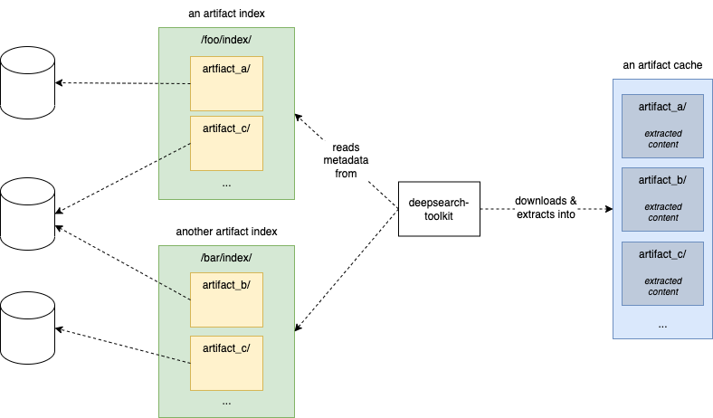

# Artifact Management

The Deep Search Toolkit provides artifact management capabilities—both via its Python SDK
and via the CLI.



- Artifact information is organized in an *artifact index*, which is a directory
  containing one subdirectory for each artifact (multiple artifact indexes are possible)
- Each artifact subdir contains a JSON file with metadata for the artifact (for filename
  check [artifact_manager.py](artifact_manager.py))
  - The name of each such subdir is used as the *artifact name*
  - The JSON file contains a key with the URL to the actual artifact data (for key name
    check [artifact_manager.py](artifact_manager.py))
- Users can download indexed artifacts to a local *artifact cache* for downstream
  processing

## Usage

### Usage with Python SDK
```python
from deepsearch.artifacts.artifact_manager import ArtifactManager

artf_mgr = ArtifactManager(
    index="/foo/index",  # set accordingly
)

artifacts_in_index = artf_mgr.get_artifacts_in_index()
print(artifacts_in_index)
# output -> ['artifact_c', 'artifact_a', 'artifact_b', 'artifact_d']

print(artf_mgr.get_artifacts_in_cache())
# output -> []

for artf_name in artifacts_in_index:
    artf_mgr.download_artifact_to_cache(
        artifact_name=artf_name,
        hit_strategy=ArtifactManager.HitStrategy.OVERWRITE,
        unpack_archives=True,
        with_progress_bar=False,
    )

print(artf_mgr.get_artifacts_in_cache())
# output -> ['artifact_c', 'artifact_a', 'artifact_b', 'artifact_d']

print(artf_mgr.get_artifact_path_in_cache(artifact_name=artifacts_in_index[0]))
# output -> /Users/pva/Library/Caches/deepsearch/artifact_cache/artifact_c

print(artf_mgr.get_cache_path())
# output -> /Users/pva/Library/Caches/deepsearch/artifact_cache
```

### Usage with CLI
```console
$ deepsearch artifacts --help
Usage: deepsearch artifacts [OPTIONS] COMMAND [ARGS]...

  Manage artifacts

Options:
  --help  Show this message and exit.

Commands:
  download                Download an artifact to cache
  download-all            Download all artifacts to cache
  list-cache              List artifacts in cache
  list-index              List artifacts in index
  locate-cached-artifact  Show path of a cached artifact
  locate-default-cache    Show cache path
```

### Environment variables

Environment variables can be used for overriding internal defaults—for the latest status,
check [artifact_manager.py](artifact_manager.py).

- `DEEPSEARCH_ARTIFACT_INDEX`: default index path
- `DEEPSEARCH_ARTIFACT_CACHE`: default cache path
- `DEEPSEARCH_ARTIFACT_META_FILENAME`: name of JSON metadata file
- `DEEPSEARCH_ARTIFACT_URL_FIELD`: field for download URL within JSON metadata file
