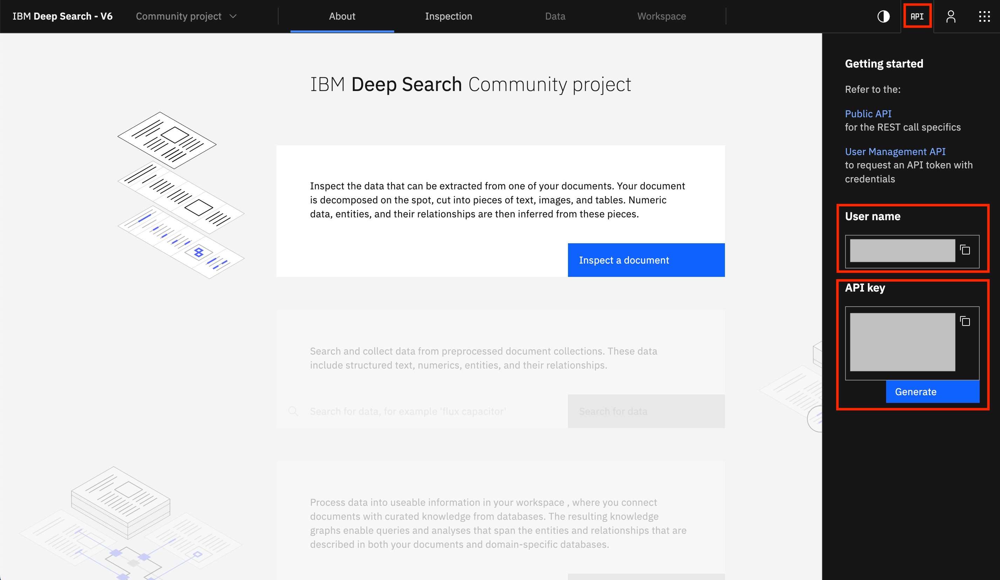

### Authentication

After registering with [Deep Search](https://ds4sd.github.io/), you can obtain your login information by clicking on API in the top-right corner. Your login information consists of your `USER-EMAIL` (User name as shown below) and an `API-KEY`.




---
### Configure

=== "CLI"
    Using the [`deepsearch login`](../cli-reference.md#login) command:
    <div class="termy">

    ```console
    $ deepsearch login

    Host [https://deepsearch-experience.res.ibm.com]:       #(1)
    Email:                                                  #(2)
    Api key:                                                #(3)
    ```

    </div>

    1.  Press Enter/Return for using default host. Otherwise, input the Deep Search deployment host to use.
    2.  Enter your login `USER-EMAIL`.
    3.  Enter your login `API-KEY`.


=== "Python"
    ```python
    import deepsearch as ds

    # API key authorization
    auth = ds.DeepSearchKeyAuth(
        username="USER-EMAIL",
        api_key="API-KEY",
    )
    # In case you have already a valid temporary access_token
    # auth = DeepSearchAuth(bearer_token="TOKEN")

    config = ds.DeepSearchConfig(
        host="https://deepsearch-experience.res.ibm.com",
        auth=auth,
    )

    client = ds.CpsApiClient(config)
    api = ds.CpsApi(client)
    ```

---

### Verify Login

All capabilities of the toolkit can only occur after a successful login configuration. Here, we verify our login configurations by checking the version Deep Search Toolkit. In addition, we recommend trying some simple operations like [listing your projects](../guide/projects.md#listprojects) or [converting a document](../guide/convert_doc.md) as shown below.

=== "CLI"
    Using the [`deepsearch version`](../cli-reference.md#version) command

    <div class="termy">

    ```console
    $ deepsearch version
    ```

    </div>


=== "Python"
    ```python
    import deepsearch as ds
    versions = ds.version()
    ```

---

### Convert Documents

Here, we show a simple way to convert documents using [Deep Search](https://ds4sd.github.io/). See the guide on [document conversion](../guide/convert_doc.md) for more details. Let `PATH_DOCS` be the path to a PDF document or a ZIP file or a directory in your local machine:

=== "CLI"
    <div class="termy">

    ```console
    $ deepsearch documents convert -p PROJ_KEY -i PATH_DOCS
    ```

    </div>

=== "Python"       
    ```python
    import deepsearch as ds                                         
    documents = ds.convert_documents(api=api, proj_key=PROJ_KEY, source_path=PATH_DOCS)

    # Let's download all the converted documents locally in RESULT_DIR
    documents.download_all(result_dir=RESULT_DIR)
    ```

--- 