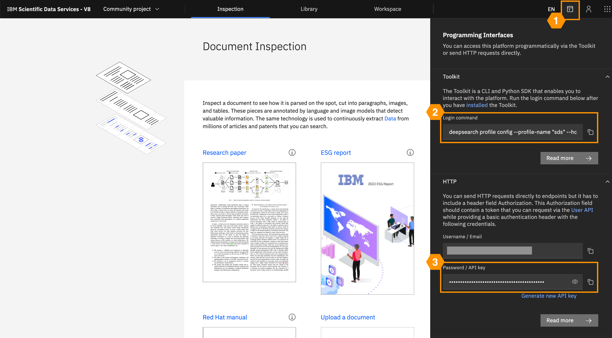

### Set up your profile

After logging in to the Deep Search UI, you can set up your profile as shown below:

1. click on the "Toolkit / API" icon on the top-right corner
2. from the "Toolkit" section, copy the command and run on your terminal
3. when prompted for the API key, copy it from the "HTTP" section



### Validate the setup

You can perform a simple validation of the profile configuration by [listing your projects](../guide/projects.md#listprojects):

=== "CLI"


    <div class="termy">

    ```console
    $ deepsearch cps projects list

    > key                         name
      --------------------------  ---------
      aaeb8bf7f6d9d12858a0b2b...  project-1
      317ffb14b1ec92fcd5985b3...  project-2
      ...                         ...
    ```

    </div>


=== "Python"
    ```python
    from deepsearch.cps.client.api import CpsApi

    api = CpsApi.from_env()

    print([p.name for p in api.projects.list()])
    # > ['project-1', 'project-2', ...]
    ```

---

### Convert documents

Here, we show a simple way to convert documents using [Deep Search](https://ds4sd.github.io/). See the guide on [document conversion](../guide/convert_doc.md) for more details. Let `PATH_DOCS` be the path to a PDF document or a ZIP file or a directory in your local machine:

=== "CLI"
    <div class="termy">

    ```console
    $ deepsearch documents convert -p PROJ_KEY -i PATH_DOCS
    ```

    </div>

=== "Python"
    ```python
    import deepsearch as ds
    documents = ds.convert_documents(api=api, proj_key=PROJ_KEY, source_path=PATH_DOCS)

    # Let's download all the converted documents locally in RESULT_DIR
    documents.download_all(result_dir=RESULT_DIR)
    ```

---


[profiles]: ../guide/configuration.md#profiles
