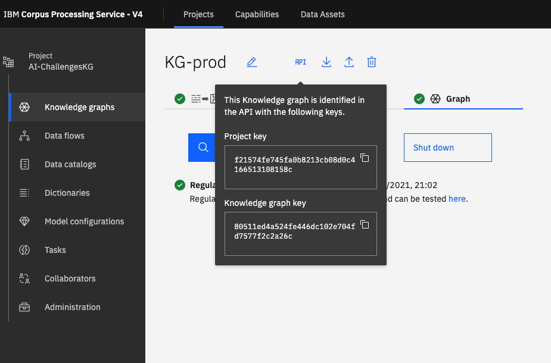

# Knowledge graphs


## Operations on KGs

When interacting with a KG, you can obtain the proj_key and kg_key identifiers from the API section of the UI.




### List the KGs in a project

```python
proj_key = "abc123" # get your proj_key from the UI details

kgs = api.knowledge_graphs.list(proj_key)
print(kgs)
```

### Query a KG

```python
from deepsearch.cps.client.queries import Query
from deepsearch.cps.client.queries.task import Value
from deepsearch.cps.client.queries.query_tasks import ForEach, Workflow
from deepsearch.cps.client.builders.wf_builder import WorkflowBuilder, WorkflowTaskOperation

proj_key = "abc123" # get your proj_key from the UI details
kg_key = "xyz987" # get kg_key (also called bag_key) from the UI details
kg = api.knowledge_graphs.get(proj_key, kg_key)

if kg is None:
    raise Exception("No such kg")

# Get the KG topology
topo = kg.get_topology()

query = Query()

builder = WorkflowBuilder()
# ... add Workflow tasks to the query

# Add Workflow and KG coordinates to the query
wf = query.add(Workflow(id="", builder=builder, coordinates=kg, inputs={}))

# Execute the query
result = api.queries.run(query)
```

More example queries are available in the [examples gallery](../gallery/index.md).
