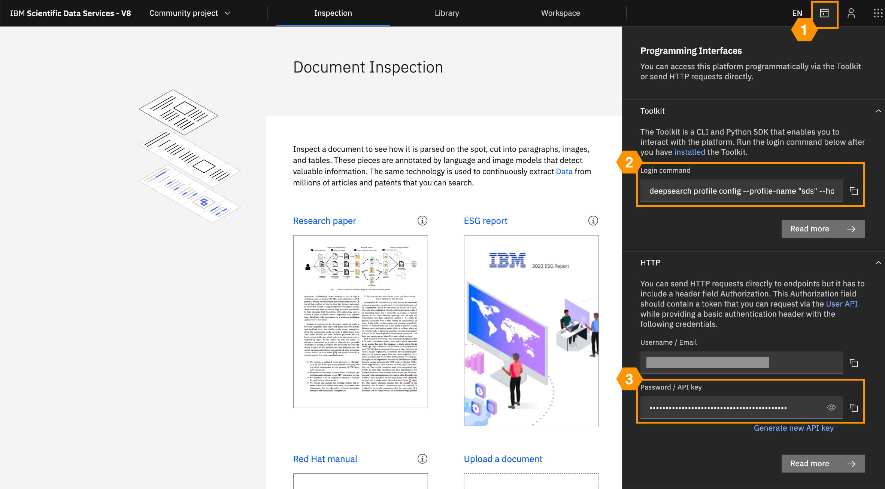

# Deep Search Toolkit

[](https://pypi.org/project/deepsearch-toolkit/)
[](https://pypi.org/project/deepsearch-toolkit/)
[](https://opensource.org/licenses/MIT)
[](https://github.com/psf/black)
[](https://ds4sd.github.io/deepsearch-toolkit/)
[](https://pepy.tech/project/deepsearch-toolkit)

*Interact with the Deep Search platform for new knowledge explorations and discoveries*

The Deep Search Toolkit is a Python SDK and CLI allowing users to interact with the Deep Search platform.
The Toolkit provides easy-to-use features for several common document workflows such as conversion, graph creation, and querying, including semantic retrieval and RAG.

[Deep Search :octicons-link-external-16:](https://ds4sd.github.io/){ .md-button .md-button--primary }
[Deep Search GitHub :octicons-link-external-16:](https://github.com/ds4sd/){ .md-button }
[Examples :octicons-link-external-16:](https://github.com/DS4SD/deepsearch-examples){ .md-button }

## Getting Started

### Install

=== "pip"

    ```shell
    pip install deepsearch-toolkit
    ```

=== "pipx"

    ```shell
    pipx install deepsearch-toolkit
    ```

=== "poetry"

    ```shell
    poetry add deepsearch-toolkit
    ```

### Set up your Profile

After logging in to Deep Search, you can set up your profile as shown below:

1. click on the *Toolkit / API* icon on the top-right corner
2. from the *Toolkit* section, copy the command and run on your terminal
3. when prompted for the API key, copy it from the *HTTP* section and complete the setup



To quickly check your profile setup, run the following — your projects should be displayed:

=== "CLI"

    ```shell
    deepsearch cps projects list
    ```

=== "Python"

    ```python
    import deepsearch as ds
    api = ds.CpsApi.from_env()
    print([p.name for p in api.projects.list()])
    ```

!!! info "Multi-profile support"

    You can set up multiple profiles, e.g. for different deployments. For details on managing profiles, check
    [Profiles](./guide/configuration.md#profiles).

### Start Using the Toolkit

Check out [Deep Search Examples :octicons-link-external-16:](https://github.com/DS4SD/deepsearch-examples) for
interactive notebooks showcasing various common usage scenarios and find inspiration on
how to make the most out of your own documents.
